> An interface-agnostic recommendation engine. Features a streaming ETL pipeline, in-memory Bayesian scoring, and a Flask API fortified by a 3-layer auth model utilizing bcrypt, self-verifying HS256 JWTs, and secure refresh tokens.

[](https://github.com/bugra-ozer/lumen/actions/workflows/ci.yml)


---

## What is it?

Lumen is an intelligent movie recommendation engine designed to filter through thousands of titles and deliver tailored suggestions.

Powered by the public IMDb dataset, Lumen evaluates films using a Bayesian averaging algorithm—the same statistical methodology utilized by IMDb's Top 250 list. This approach corrects for vote-count bias, ensuring that statistically significant ratings (e.g., an 8.5 rating across 50,000 votes) appropriately outrank skewed outliers (e.g., a 9.0 rating with only 50 votes).

The core engine is served through a **Flask REST API** with JWT-based authentication, and allows users to dynamically query by genre and rating per request. Additionally, a Command Line Interface (CLI) is provided for local deployment and testing.

---

## Architecture



---

## Tech Stack
 
| Layer          | Technology                                          |
|----------------|-----------------------------------------------------|
| Language       | Python 3.10+                                        |
| API            | Flask 3.1+                                          |
| Database       | PostgreSQL, psycopg2-binary, Flask-SQLAlchemy, Flask-Migrate |
| Data processing| Pandas, PyArrow, NumPy                              |
| Dataset        | IMDB public TSV datasets                            |
| Authentication | PyJWT, bcrypt                                       |
| Config         | python-dotenv                                       |
| CLI            | Custom terminal UI, tqdm                            |

---

## ETL Pipeline

IMDB distributes its dataset as gzip-compressed TSV files. On first run, Lumen:

1. **Streams** the compressed files from IMDB using `requests` — no full download into memory
2. **Decompresses** on the fly with `gzip`
3. **Parses and merges** multiple TSV files into a single DataFrame with `pandas`
4. **Caches** the result as a Parquet file via `pyarrow` for fast subsequent loads

Progress is tracked with `tqdm`. On subsequent runs, the pipeline skips straight to loading from Parquet — significantly faster startup.

---
 
## API Endpoints
 
- `POST /login` — Returns JWT access token + refresh token
- `POST /refresh` — Exchanges refresh token for new access token
- `POST /recommendations` — Returns scored, filtered movie list *(protected)*
- `GET /health` — Service health check
All protected routes require `Authorization: Bearer <token>`.
 
---

## Auth Design

Three-layer security stack:

- **bcrypt** (cost factor 12) — password hashing.
- **JWT (HS256)** — self-verifying signed access tokens, 15-minute expiry, no DB lookup required per request
- **secrets.token_hex** — cryptographically random refresh tokens, 30-day expiry, server-side dictionary lookup

---

## Bayesian Scoring

Standard weighted rating formula:

$$Score = \left(\frac{v}{v + m}\right) r + \left(\frac{m}{v + m}\right) c$$

Where `v` = vote count, `m` = minimum votes threshold, `r` = movie average, `c` = global average. Scores are computed once at startup across the full dataset and held in memory.

## Decay Factor
 
A time-based penalty is applied to account for a movie's age, ensuring older titles don't compete on equal footing with newer releases when recency matters.
 
$$\text{decay factor} = f^{\,\text{years old}}$$

Where `f` is a decay base constant between `0` and `1` (e.g. `0.997`), and `years_old` is the number of full years since the movie's release year. A value close to `1` applies only a mild penalty.

## Adjusted Score
 
The final ranking score combines the Bayesian rating with the decay factor:
 
$$\text{adjusted score} = \text{decay factor} \times \text{bayesian score}$$
 
This preserves the robustness of the Bayesian estimate while introducing a mild recency bias. Like the base score, adjusted scores are computed once at startup and held in memory alongside their components.


---

## Getting Started

```bash
## Requirements
- Python 3.10+
- Docker Desktop

## Running

# Clone the repo
git clone https://github.com/bugra-ozer/lumen
cd lumen

# Install dependencies
pip install -r requirements.txt

# Set environment variables
cp .env.example .env  # fill in SECRET_KEY and DATABASE_URL

# Start PostgreSQL
docker-compose up -d

# Run the API
python api/api.py

# Or run the CLI
python main.py
```

## Author

**Bugra Ozer** — [github.com/bugra-ozer](https://github.com/bugra-ozer)
